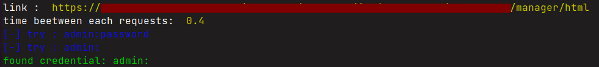

# bf_tomcat_manager

A simple tool for testing  default credentials on tomcat manager

# Install : 

```
pip install -r requirements.txt
```

# usage: 

```bash

python3 bf_manager.py <URL> <TIME BEETWEEN REQUEST>
<URL> : url of tomcat manager endpoint
<TIME>: time beetween each attempt (ex: 1 seconde)

ex: 

python3 bf_manager.py   https://some-site/manager/html 0.4

```

# example of output :




# ressource : 

list of credential from : 

https://github.com/netbiosX/Default-Credentials/blob/master/Apache-Tomcat-Default-Passwords.mdown
